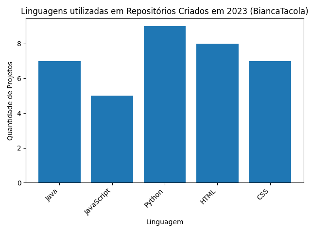

<h2 align="center"> :signal_strength:  Análise de Repositórios criados no GitHub em 2023 </h2>

<h3 align="center">⭐Detalhes do Código:⭐</h3>

➡️Obtendo Repositórios: Biblioteca requests para fazer uma solicitação à API do GitHub e obter a lista de repositórios do usuário.

➡️Coletando Informações: Para coletar informações sobre as linguagens usadas nos repositórios criados em 2023.

➡️Gerando o Gráfico: Para gerar um gráfico de barras foi utilizado a biblioteca matplotlib.pyplot. Foi configurados rótulos, título e a rotação dos rótulos no eixo X para melhor legibilidade.

➡️Adicionando Números nas Barras: Para adicionar o número de projetos dentro das barras, foi utilizado o plt.text() 

➡️Ajustando o Eixo Y: Para representar os meses de 2023 no eixo Y, foi utilizado o plt.yticks() 

➡️Salvando o Gráfico: Para salvar o gráfico como um arquivo de imagem, foi utilizado o plt.savefig() 

➡️Exibindo o Gráfico: Para exibir o gráfico na tela, foi utilizado o plt.show() 

